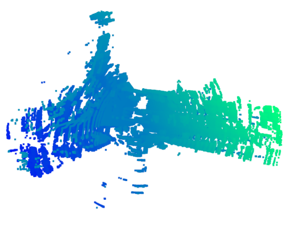

# Point Cloud Semantic Segmentation - Point Painting

To run this project follow these steps:
1) Run the `2 download shell script files`. This will download the particular sequence of KITTI-360.
3) Convert the binary files to pcd with the `bin2pcd.py` in Code folder.
4) Make an map using ICP by running the `icp.py` file in Code/pcd_folder folder.

5) Semantically segment images by running `semantic_segmentation.py` in DeepLabV3Plus-Pytorch folder.
6) Again generate the map using `icp.py`

Alternatively , run the `run.bash` script which will everything for you.

NOTE: Download the pretrained weights for the network from `https://www.dropbox.com/sh/w3z9z8lqpi8b2w7/AAABmvcqWdVtTJCFQ75OmK0va/best_deeplabv3_resnet101_voc_os16.pth?dl=0` and store them in the `Code` folder.
Keep the first 50 frames from the dowloaded sequence for our project.

